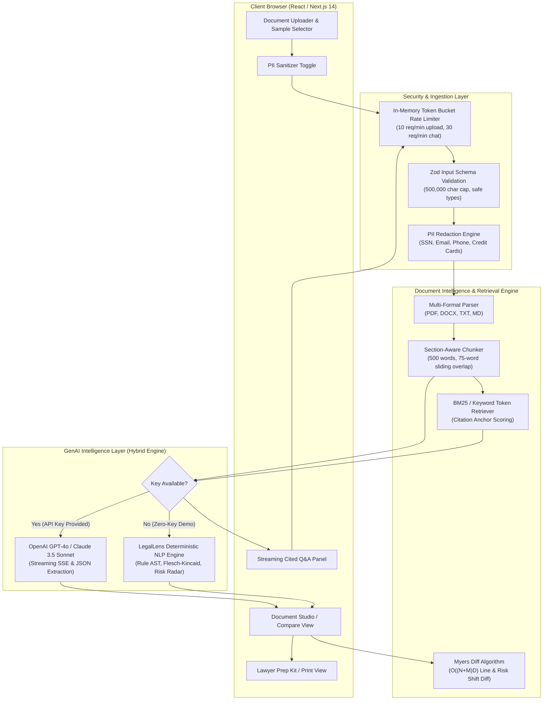

# LegalLens AI — System Architecture & Data Flow

LegalLens AI is an end-to-end legal document intelligence platform built with Next.js 14, TypeScript, and Tailwind CSS. It empowers non-lawyers, tenants, freelancers, and small business owners to understand complex legal documents, detect hidden risks, compare contract revisions, interact via grounded streaming Q&A, and generate attorney consultation briefs.

---

## 1. High-Level Data Flow Architecture

---

## 2. Core Subsystems

### 2.1 Ingestion & Privacy Layer
- **Input Validation**: All incoming payloads are validated strictly with `zod` schemas (`AnalyzeDocumentSchema`, `ChatRequestSchema`, `CompareDocumentsSchema`), rejecting malformed structures and requests exceeding 500,000 characters.
- **Client/Server PII Redaction**: Sensitive personal identifiers (Social Security Numbers, credit cards, emails, and phone numbers) are detected via regular expressions and replaced with deterministic redaction markers (`[REDACTED_SSN_1]`, `[REDACTED_EMAIL_1]`) prior to AI processing.
- **Zero Data Retention**: Document text is parsed purely in-memory (ephemeral processing) and never saved unencrypted to disk or external databases.

### 2.2 Semantic Chunking & Grounded Retrieval
- **Section-Aware Boundary Splitting**: Legal contracts are partitioned along standard section titles (`SECTION`, `ARTICLE`, `CLAUSE`, numbered headings).
- **Sliding Window**: Chunks are sized at ~450–500 words with a 75-word overlap to ensure cross-sentence obligations and covenants remain intact.
- **Citation Anchors**: When questions are asked, the retrieval engine scores chunks against query terms, extracts a 150-character contextual snippet, and generates a grounded citation object referencing the exact section title and quote.

### 2.3 Hybrid GenAI Dispatcher
- **Live LLM Integration**: When `OPENAI_API_KEY` or `ANTHROPIC_API_KEY` is present in `.env.local` or session settings, requests are routed to OpenAI (`gpt-4o` / `gpt-4o-mini`) or Anthropic (`claude-3-5-sonnet`) with streaming Server-Sent Events (SSE).
- **Local Intelligence Engine**: When running in zero-key evaluator mode, the built-in deterministic legal intelligence engine extracts clauses across 7 categories, calculates Flesch-Kincaid reading scores, flags omitted protections (e.g. missing liability caps, missing cure periods), and streams grounded responses.

### 2.4 Contract Comparison & Diff Engine
- **Myers Diff Algorithm**: Evaluates differences between original and revised contracts.
- **Algorithmic Complexity**:
  - **Time Complexity**: $O((N + M) \times D)$ where $N$ and $M$ are line counts and $D$ is the edit distance.
  - **Space Complexity**: $O(N + M)$ linear space.
  - **Practical Performance**: Under 15 milliseconds for typical 20-page commercial contracts.
- **Semantic Risk Shift Detection**: Tracks shifts in liability exposure (capped vs uncapped), termination notice windows, evergreen auto-renewal clauses, and governing jurisdictions.

### 2.5 Lawyer Prep Kit & Export Pipeline
- Synthesizes high-risk clauses, financial exposure estimates, and customized questions into a structured 1-page consultation dossier.
- Formatted with `@media print` CSS for instant clean export to PDF or physical printout.
