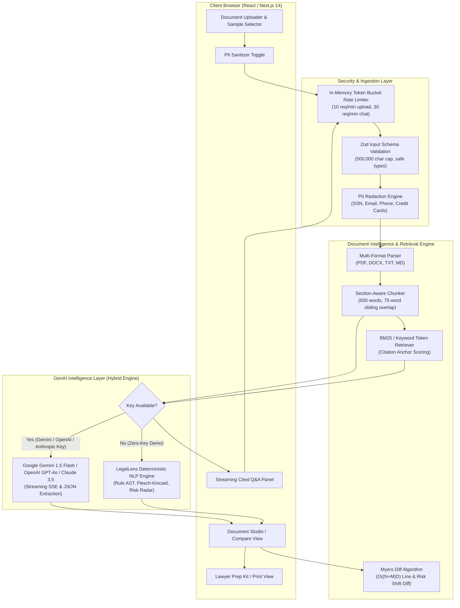

# LegalLens AI — System Architecture & Data Flow

LegalLens AI is an end-to-end legal document intelligence platform built with Next.js 14, TypeScript, and Tailwind CSS. It empowers non-lawyers, tenants, freelancers, and small business owners to understand complex legal documents, detect hidden risks, compare contract revisions, interact via grounded streaming Q&A, and generate attorney consultation briefs.

---

## 1. High-Level Data Flow Architecture

---

## 2. Core Subsystems

### 2.1 Ingestion, Security & Privacy Layer
- **Input Validation**: All incoming payloads are validated strictly with `zod` schemas (`AnalyzeDocumentSchema`, `ChatRequestSchema`, `CompareDocumentsSchema`), rejecting malformed structures and requests exceeding 500,000 characters.
- **Multi-Tier PII Redaction**: Sensitive personal identifiers (SSNs, credit cards, bank account/routing numbers, taxpayer IDs/EINs, passport numbers, and physical street addresses) are detected via regular expressions and replaced with deterministic redaction markers (`[REDACTED_BANK_1]`, `[REDACTED_SSN_1]`) prior to AI processing.
- **Prompt Injection Defense**: All untrusted document text is wrapped in strict bounding delimiters (`<<<START_USER_DOCUMENT_TEXT>>>` ... `<<<END_USER_DOCUMENT_TEXT>>>`) paired with explicit passive data directives instructing the LLM to ignore any embedded system command overrides.
- **In-Memory Rate Limiting with Auto-Eviction**: Token bucket rate limiter with stale bucket cleanup (`cleanExpiredBuckets`) preventing memory leaks during extended server uptime.
- **Zero Data Retention**: Document text is parsed purely in-memory (ephemeral processing) and never saved unencrypted to disk or external databases.

### 2.2 In-Memory LRU Document Caching Layer
- **SHA-256 Fingerprinting**: Contracts are normalized and hashed via SHA-256 (`computeDocumentHash(text, provider)`).
- **Sub-2ms Hit Latency**: Duplicate analyses and view reloads are served instantly from the LRU cache without hitting LLM endpoints or incurring token costs.
- **Telemetry & Cache Eviction**: Dynamic tracking of hits, misses, and hit ratio with automatic least-recently-used eviction at 100 entries.

### 2.3 Semantic Chunking & Grounded Retrieval
- **Section-Aware Boundary Splitting**: Legal contracts are partitioned along standard section titles (`SECTION`, `ARTICLE`, `CLAUSE`, numbered headings).
- **Sliding Window**: Chunks are sized at ~450–500 words with a 75-word overlap to ensure cross-sentence obligations and covenants remain intact.
- **Citation Anchors**: When questions are asked, the retrieval engine scores chunks against query terms, extracts a 150-character contextual snippet, and generates a grounded citation object referencing the exact section title and quote.

### 2.4 Hybrid GenAI Dispatcher
- **Live LLM Integration**: When `GEMINI_API_KEY`, `OPENAI_API_KEY`, or `ANTHROPIC_API_KEY` is present in `.env.local` or user session settings, requests are routed to **Google Gemini 1.5 Flash** (`gemini-1.5-flash`), OpenAI (`gpt-4o` / `gpt-4o-mini`), or Anthropic (`claude-3-5-sonnet`) with streaming Server-Sent Events (SSE) and strict JSON schema responses.
- **Local Intelligence Engine**: When running in zero-key evaluator mode, the built-in deterministic legal intelligence engine extracts clauses across 7 categories, calculates Flesch-Kincaid reading scores, flags omitted protections (e.g. missing liability caps, missing cure periods), and streams grounded responses.

### 2.5 Contract Comparison & Diff Engine
- **Myers Diff Algorithm**: Evaluates differences between original and revised contracts.
- **Algorithmic Complexity**:
  - **Time Complexity**: $O((N + M) \times D)$ where $N$ and $M$ are line counts and $D$ is the edit distance.
  - **Space Complexity**: $O(N + M)$ linear space.
  - **Practical Performance**: Under 15 milliseconds for typical 20-page commercial contracts.
- **Semantic Risk Shift Detection**: Tracks shifts in liability exposure (capped vs uncapped), termination notice windows, evergreen auto-renewal clauses, and governing jurisdictions.

### 2.6 Problem Statement Specializations & Export Pipeline
- **Reading Level Perspectives**: Provides instant toggling between *8th-Grade Plain English*, *Commercial Executive Brief*, and *Statutory Legal Precision*.
- **Negotiation Playbook**: Concrete counter-proposals and negotiation strategies for high/medium risk clauses with 1-click clipboard export.
- **Due Diligence Action Checklist**: Interactive checklist with 1-click export to Markdown (`.md`), CSV (`.csv`), or Clipboard.
- **Lawyer Prep Kit**: Synthesizes high-risk clauses, financial exposure estimates, and customized questions into a structured 1-page consultation dossier with PDF printing, Markdown export, and copying.
- **WCAG 2.1 AAA Accessibility**: High-contrast mode, typographic scaler, global access keys (`Alt+1..3`, `Alt+K`, `Alt+C`, `Alt+F`, `?`), and screen-reader live announcements.
